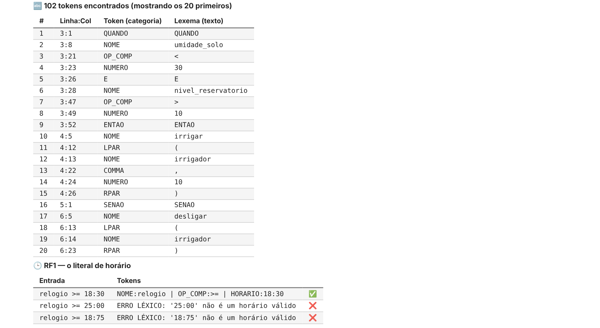
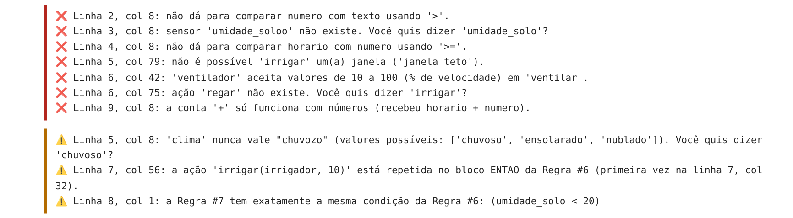
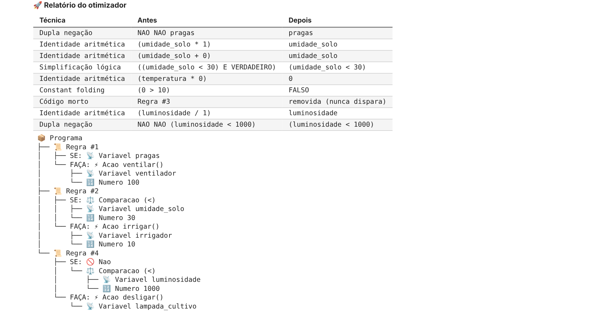
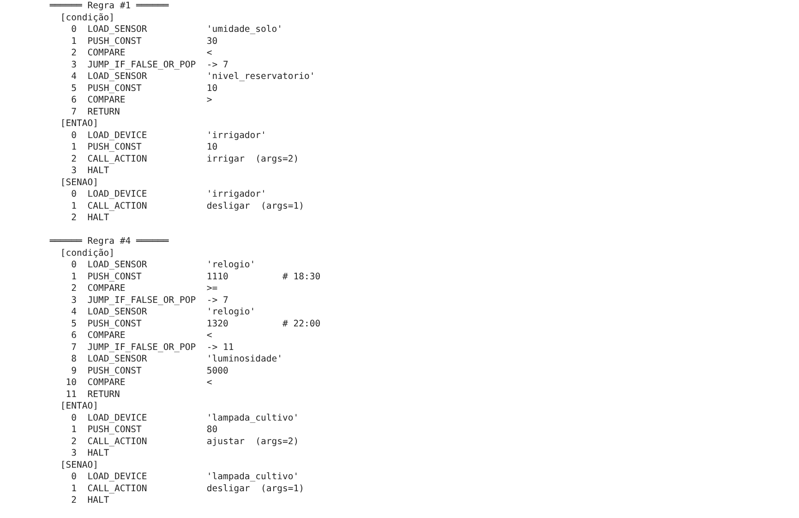
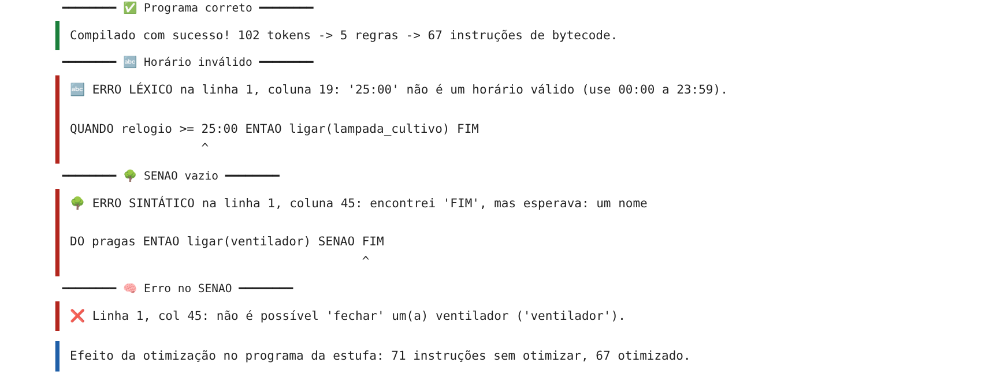
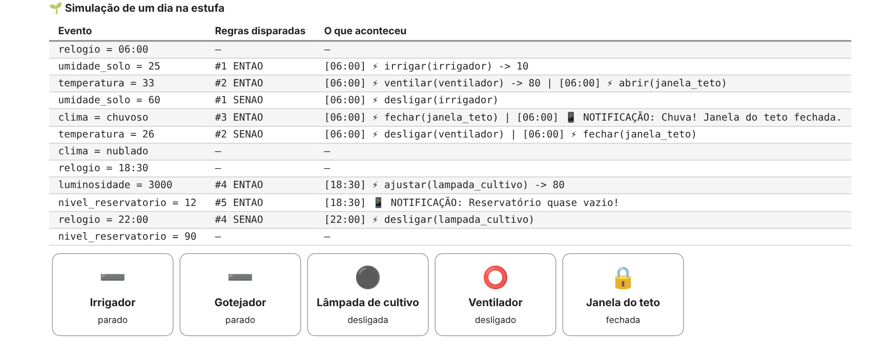
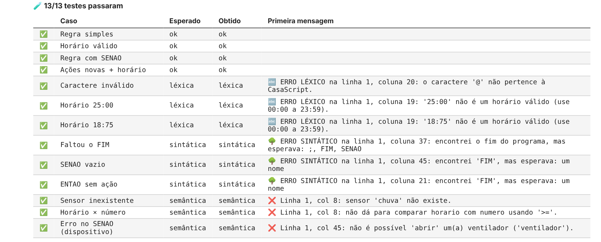

# CasaScript 2.0 - Estufa Inteligente

Guilherme Pedigone RA: 2712633  
Laryssa Dantas RA: 2342968  
Gabriel Diogo RA: 2683210

Projeto da Prática 2 de Compiladores (Aula CP 06).

## Cenário

Escolhemos a **estufa / horta inteligente**.

Numa estufa, quase tudo depende de regras simples que se repetem o dia inteiro: irrigar quando o solo está seco, ventilar quando esquenta demais, acender a luz de cultivo quando escurece e fechar a janela quando chove. Isso é bem comum em agricultura de precisão e em fazendas verticais. Quem cuida das plantas geralmente não é programador, então faz sentido ter uma linguagem simples para escrever essas regras e um compilador que avise quando alguma regra não faz sentido antes de ela rodar. Por exemplo, irrigar por 90 minutos pode encharcar a plantação, e comparar o relógio com um número faz a regra nunca disparar.

## Tabela de símbolos

**Sensores**

| Sensor | Tipo | Valores |
|---|---|---|
| umidade_solo | número | 0 a 100 (%) |
| temperatura | número | -10 a 50 (°C) |
| luminosidade | número | 0 a 100000 (lux) |
| nivel_reservatorio | número | 0 a 100 (%) |
| clima | texto | "ensolarado", "nublado", "chuvoso" |
| pragas | lógico | VERDADEIRO / FALSO |
| relogio | horário | 00:00 a 23:59 |

**Dispositivos**

| Dispositivo | Tipo |
|---|---|
| irrigador | irrigador |
| gotejador | irrigador |
| lampada_cultivo | lampada |
| ventilador | ventilador |
| janela_teto | janela |

**Ações**

| Ação | Usada em | Observação |
|---|---|---|
| ligar / desligar | irrigador, lampada, ventilador | |
| ajustar(disp, n) | lampada | brilho de 0 a 100 |
| irrigar(disp, n) | irrigador | **nova**, de 1 a 60 minutos |
| ventilar(disp, n) | ventilador | **nova**, velocidade de 10 a 100 |
| abrir / fechar | janela | |
| notificar("msg") | - | |

## O que foi feito em cada requisito

**RF1 - Horário (fase léxica)**
Criamos o token `HORARIO` no formato HH:MM. No começo o `18:30` estava virando `18`, `:` e `30`, porque o NUMERO casava primeiro. Resolvemos colocando prioridade maior no token (`HORARIO.2`). Para dar erro léxico em `25:00` ou `18:75`, a validação foi feita num callback do lexer. Na AST, o horário é guardado em minutos (18:30 = 1110). Também foi preciso mexer na semântica: o tipo novo `horario` só pode ser comparado com outro horário. Células: 3, 6, 7, 9 e 10.

**RF2 - SENAO (fase sintática)**
Na gramática a regra ficou `"QUANDO" expr "ENTAO" acoes [senao] "FIM"`, com `senao : "SENAO" acoes`. Como `acoes` precisa ter pelo menos uma ação, `SENAO FIM` já dá erro de sintaxe. A classe `Regra` ganhou o campo `senao`, que aparece no desenho da AST e no bytecode. Células: 3, 6, 10 e 13.

**RF3 - Semântica (fase semântica)**
Trocamos a tabela de símbolos pela da estufa e colocamos as faixas das ações novas. As ações do SENAO passam pelo mesmo `verificar_acao` do ENTAO. Também adicionamos dois avisos:
- a mesma ação com os mesmos argumentos repetida dentro do bloco;
- duas regras com a mesma condição (comparamos o texto que a função `mostrar()` gera).

Célula: 7.

**RF4 - Otimização**
Adicionamos a eliminação de dupla negação (`NAO NAO x` vira `x`) e as identidades aritméticas (`x+0`, `x-0`, `x*1` e `x/1` viram `x`, e `x*0` vira `0`). Primeiro roda a otimização da aula e depois as novas. As duas aparecem no relatório do otimizador. Célula: 9.

**RF5 - Geração de código e runtime**
Cada regra compilada agora tem 3 blocos: condição, ENTAO e SENAO. Se não tiver SENAO, o bloco fica só com HALT. O horário é gerado como `PUSH_CONST` com os minutos. Criamos a classe `Estufa` no lugar da `Casa`, e a central executa o SENAO na borda de descida (quando a condição passa de verdadeiro para falso). Células: 10, 11 e 13.

**RF6 - Testes e simulação**
A bateria tem 13 casos, e todos passam:
- 4 corretos;
- 3 léxicos (dois de horário inválido);
- 3 sintáticos (um com SENAO vazio);
- 3 semânticos (um com erro dentro do SENAO).

A simulação do dia tem 12 eventos, e dá para ver o ENTAO e o SENAO disparando. Células: 13 e 16.

## Exemplo

Programa:

```
QUANDO umidade_solo < 30 E nivel_reservatorio > 10 ENTAO
    irrigar(irrigador, 10)
SENAO
    desligar(irrigador)
FIM

QUANDO relogio >= 18:30 E relogio < 22:00 E luminosidade * 1 < 5000 ENTAO
    ajustar(lampada_cultivo, 80)
SENAO
    desligar(lampada_cultivo)
FIM
```

Bytecode gerado (o `luminosidade * 1` some por causa da otimização):

```
══════ Regra #1 ══════
  [condição]
    0  LOAD_SENSOR           'umidade_solo'
    1  PUSH_CONST            30
    2  COMPARE               <
    3  JUMP_IF_FALSE_OR_POP  -> 7
    4  LOAD_SENSOR           'nivel_reservatorio'
    5  PUSH_CONST            10
    6  COMPARE               >
    7  RETURN
  [ENTAO]
    0  LOAD_DEVICE           'irrigador'
    1  PUSH_CONST            10
    2  CALL_ACTION           irrigar  (args=2)
    3  HALT
  [SENAO]
    0  LOAD_DEVICE           'irrigador'
    1  CALL_ACTION           desligar  (args=1)
    2  HALT

══════ Regra #4 ══════
  [condição]
    0  LOAD_SENSOR           'relogio'
    1  PUSH_CONST            1110          # 18:30
    2  COMPARE               >=
    3  JUMP_IF_FALSE_OR_POP  -> 7
    4  LOAD_SENSOR           'relogio'
    5  PUSH_CONST            1320          # 22:00
    6  COMPARE               <
    7  JUMP_IF_FALSE_OR_POP  -> 11
    8  LOAD_SENSOR           'luminosidade'
    9  PUSH_CONST            5000
   10  COMPARE               <
   11  RETURN
  [ENTAO]
    0  LOAD_DEVICE           'lampada_cultivo'
    1  PUSH_CONST            80
    2  CALL_ACTION           ajustar  (args=2)
    3  HALT
  [SENAO]
    0  LOAD_DEVICE           'lampada_cultivo'
    1  CALL_ACTION           desligar  (args=1)
    2  HALT
```

## Prints dos resultados

**Lexer reconhecendo o horário (RF1)**



**Erros e avisos da análise semântica (RF3)**, com os dois avisos novos no final



**Relatório do otimizador (RF4)**



**Bytecode com os blocos ENTAO e SENAO (RF5)**



**Compilador completo pegando erros em fases diferentes**



**Simulação de um dia na estufa (RF6)**



**Bateria de testes (RF6)**



## Como rodar

Abrir o notebook no Colab e usar "Ambiente de execução > Reiniciar e executar tudo". Para rodar no VS Code, antes é preciso instalar `lark`, `ipywidgets` e `ipykernel`.
